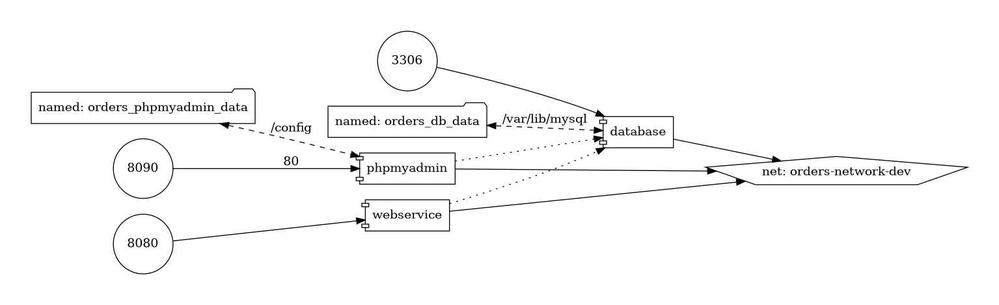

# InfuseTech - Web Service de Pedidos


Avaliação técnica para a posição de engenheiro de software na [Infuse Tecnologia Ltda](https://www.infuse.srv.br/). Web service que provê uma API RESTful para manipulação de dados básicos de pedidos.

## TOC
<!-- TOC -->

- [InfuseTech - Web Service de Pedidos](#infusetech---web-service-de-pedidos)
  - [TOC](#toc)
  - [Preliminares](#preliminares)
  - [Topologia do projeto](#topologia-do-projeto)
  - [Manipulação do projeto](#manipula%C3%A7%C3%A3o-do-projeto)
  - [O que deseja fazer?](#o-que-deseja-fazer)

<!-- /TOC -->

## Preliminares

Esse projeto foi desenvolvido utilizando as seguintes ferramentas:

- [Software Development Kit Manager (`sdkman`)](https://sdkman.io/): v5.18.1 ou superior. É recomendado esse gerenciador para a instalação local das seguintes dependências;
  - [OpenJDK (`java`)](https://nodejs.org/dist/v20.11.1/node-v20.11.1.tar.gz): versão LTS 64-bit (v17.0.12) ou superior:
    - Instalação [manual](https://www.oracle.com/java/technologies/javase/jdk17-archive-downloads.html);
    - Instalação com o [`sdkman`](https://maven.apache.org/install.html);
  - [Apache Maven (`mvn`)](https://yarnpkg.com/getting-started): v3.6.3 ou superior:
    - Instalação [manual](https://maven.apache.org/install.html);
    - Instalação com o [`sdkman`](https://sdkman.io/sdks/#maven);
- [Docker Engine](https://docs.docker.com/engine/install/ubuntu/): v24.0.2 ou superior:
  - [Comando `docker` sem ser `sudo`](https://docs.docker.com/engine/install/linux-postinstall/). Opcional;
- [Docker Compose](https://docs.docker.com/compose/install/linux/): v2.27.0 ou superior;
- [GNU Make](https://www.gnu.org/software/make/): v4.3 ou superior.

## Topologia do projeto



Como ilustra o diagrama, a comunicação entre serviços do cluster via TCP/HTTP se dá em uma rede particular ([`orders-network-dev`](./docker-compose.yml#L39)) e também, para efeito de acesso externo, portas são expostas por esses serviços para comunicação.

Segue abaixo uma listagem das assinaturas de URL, para as diferentes redes:

| **Serviço** | **Descrição**                                            | **Protocolos** | **URL externa**          | **URL interna**            |
| ----------- | -------------------------------------------------------- | -------------- | ------------------------ | -------------------------- |
| webservice  | Aplicação Spring Boot que fornece a API REST de pedidos  | TCP,HTTP       | <http://localhost:8080>  | <http://webservice:8080>   |
| phpmyadmin  | Ferramenta para manipulação do banco de dados MySQL      | TCP,HTTP       | <http://localhost:8090>  | <http://phpmyadmin:8090>   |
| database    | Servidor de banco de dados relacional MySQL              | TCP            | tcp://localhost:3300     | tcp://database:3300        |

> [!IMPORTANT]  
> Concernindo as URLs supracitadas, as **externas** são classificadas assim pois são **externas à rede do Docker**, e.g. quando a aplicação Spring Boot está sendo rodada localmente na máquina.
> Similarmente, uma URL é dita **interna** pois é **interna à rede do Docker**, e.g. quando tanto a aplicação Spring Boot quanto o servidor MySQL estão rodando em seus conteineres, um se comunicando com o outro via TCP.

## Manipulação do projeto

Através do `make`, via scripts de automação do Docker Compose implementados em um [Makefile](./Makefile), na raíz do projeto. Para conferir a documentação de cada script, basta executar no terminal

```bash
make
```

ou

```bash
make help
```

---

## O que deseja fazer?

- [Voltar para TOC](#toc)
- [Execução da plataforma - Servidor MySQL](./docs/md/DATABASE.md)
- [Execução da plataforma - Web Service Java](./docs/md/WEBSERVICE.md)
- [Execução da plataforma - API de Pedidos](./docs/md/API-TESTING.md)
- [Especificações originais](./docs/md/ORIGINAL-SPECS.md)
